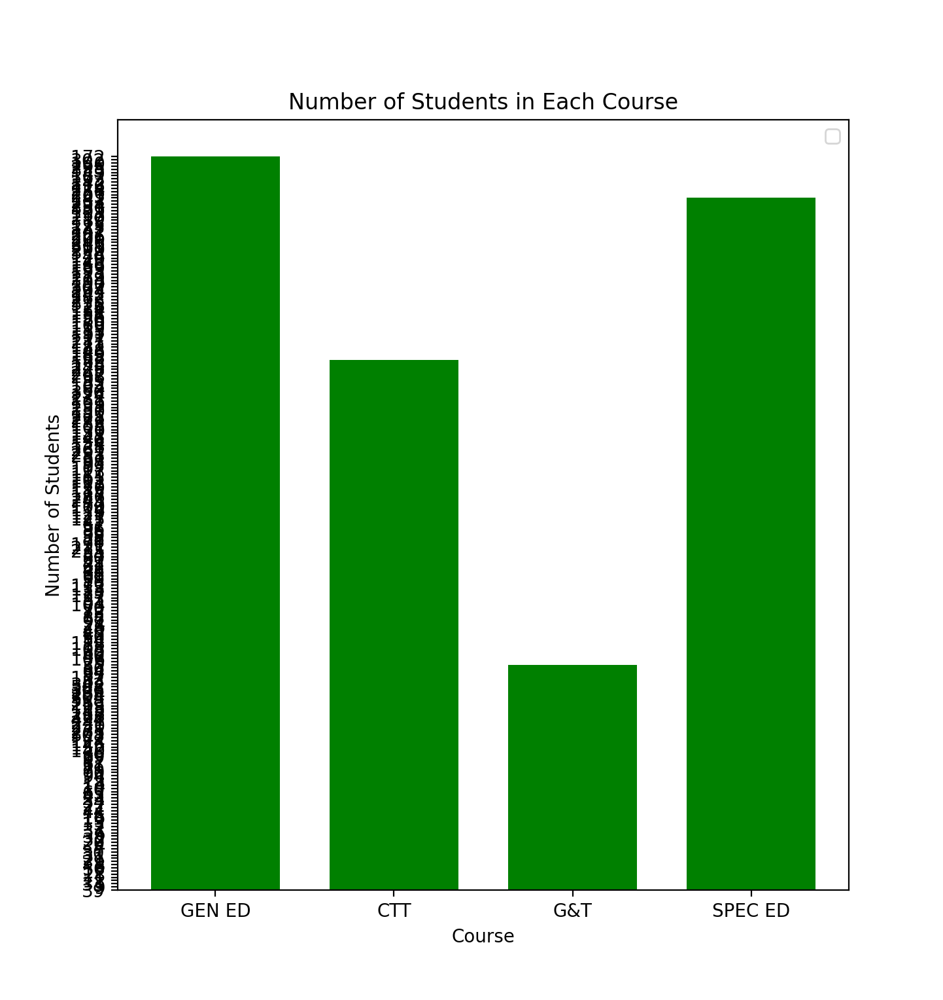

# HW_02
 Here I plotted data for the average test scores across schools and class sizes across school districts.

<h2> **Average Test Score by Race** <h2>
This graph represents the results of the New York State math test in New York City. The graph shows the average score of a certain race/ethnicity in Grades 3-8 from 2006 to 2011. The data includes asian, black, hispanic, and white students. 
https://catalog.data.gov/dataset/2006-2011-nys-math-test-results-by-grade-citywide-by-race-ethnicity 

 

<h2> Number of Students in Courses <h2>

This graph shows the class size of certain courses across school districts. It covers grades k-12 and is based on 2011 data. Sadly, try as Brandon and I might, I could not fix the y axis to display the numbers correctly. 
https://catalog.data.gov/dataset/2010-2011-class-size-district-level-summary

 

https://github.com/mikeizbicki/cmc-csci040/tree/2021fall/hw_02 